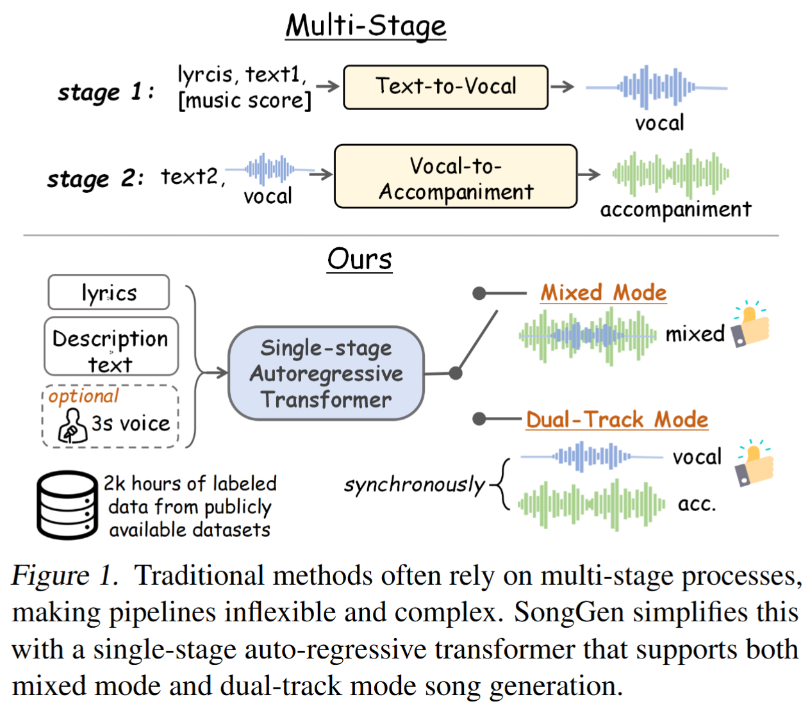

# SongGen: A Single Stage Auto-regressive Transformer for Text-to-Song Generation

🚀🚀🚀 Official implementation of **SongGen: A Single Stage Auto-regressive Transformer for Text-to-Song Generation**
<p align="center" style="font-size: 1 em; margin-top: -1em">
<a href="https://scholar.google.com/citations?user=iELd-Q0AAAAJ">Zihan Liu</a>,  
<a href="https://mark12ding.github.io/">Shuangrui Ding</a>,  
<a href="https://github.com/rookiexiong7/">Zhixiong Zhang</a>, 
<a href="https://lightdxy.github.io/">Xiaoyi Dong</a>,  
<a href="https://panzhang0212.github.io/">Pan Zhang</a>,
<a href="https://yuhangzang.github.io/">Yuhang Zang</a>,  
<a href="https://scholar.google.com/citations?user=sJkqsqkAAAAJ">Yuhang Cao</a>, </br>  
<a href="http://dahua.site/">Dahua Lin</a>,  
<a href="https://myownskyw7.github.io/">Jiaqi Wang</a> 
</p>

<p align="center" style="font-size: 5 em; margin-top: 0.5em">
<a href="https://arxiv.org/abs/2502.13128">"></a>
<a href="https://github.com/LiuZH-19/SongGen"></a>
<a href="https://liuzh-19.github.io/SongGen/"></a>
</p>


## 📜 News
🚀 [2025/2/19] The [paper](https://arxiv.org/abs/2502.13128) and [demo page](https://liuzh-19.github.io/SongGen/) are released!

## 💡 Highlights
- 🔥We introduce SongGen, a **single-stage** auto-regressive transformer for **text-to-song** generation, offering versatile control via lyrics, descriptive text, and an optional reference voice.
- 🔥SongGen supports both **mixed** and **dual-track mode** to accommodate diverse requirements. Our experiments provide **valuable insights** for optimizing both modes.
- 🔥By releasing the **model weights**, **code**, **annotated data**, and **preprocessing pipeline**, we aim to establish a simple yet effective baseline for future song generation research.
<!--  -->

## 👨‍💻 Todo
- [ ] Release annotated data and preprocessing pipeline
- [ ] Release SongGen training code
- [ ] Develop an audio upsampling renderer
- [ ] Release SongGen checkpoints
- [x] Release SongGen inference code 
- [x] SongGen demo

## 🛠️ Usage

### 1. Install environment and dependencies
```bash
git clone https://github.com/LiuZH-19/SongGen.git
cd SongGen
# We recommend using conda to create a new environment.
conda create -n songgen python=3.9.18 
conda activate songgen
# install cuda >= 11.8
conda install pytorch torchvision torchaudio cudatoolkit=11.8 -c pytorch -c nvidia
```
To use SongGen only in inference mode, install it using:
```bash
pip install .
```
### 2. Download the xcodec and songgen checkpoints


### 3. Run the inference

#### (1). Mixed Pro Mode

```python
import torch
import os
from songgen import (
    VoiceBpeTokenizer,
    SongGenMixedForConditionalGeneration,
    SongGenProcessor
)
import soundfile as sf

ckpt_path = "..." # Path to the pretrained model
device = "cuda:0" if torch.cuda.is_available() else "cpu"
model = SongGenMixedForConditionalGeneration.from_pretrained(
    ckpt_path,
    attn_implementation='sdpa').to(device)
processor = SongGenProcessor(ckpt_path, device)

# Define input text and lyrics
lyrics = "..." # The lyrics text
text="..." # The music description text
ref_voice_path = 'path/to/your/reference_audio.wav' # Path to reference audio, optional
separate= True # Whether to separate the vocal track from the reference voice audio

model_inputs = processor(text=text, lyrics=lyrics, ref_voice_path=ref_voice_path, separate=True) 
generation = model.generate(**model_inputs,
                do_sample=True,
            )
audio_arr = generation.cpu().numpy().squeeze()
sf.write("songgen_out.wav", audio_arr, model.config.sampling_rate)
```


#### (2). Interleaving A-V  (Dual-track mode)
```python
import torch
import os
from songgen import (
    VoiceBpeTokenizer,
    SongGenDualTrackForConditionalGeneration,
    SongGenProcessor
)
import soundfile as sf

ckpt_path = "..." # Path to the pretrained model
device = "cuda:0" if torch.cuda.is_available() else "cpu"
model = SongGenDualTrackForConditionalGeneration.from_pretrained(
    ckpt_path,
    attn_implementation='sdpa').to(device)
processor = SongGenProcessor(ckpt_path, device)

# Define input text and lyrics
lyrics = "..." # The lyrics text
text="..." # The music description text
ref_voice_path = 'path/to/your/reference_audio.wav' # Path to reference audio, optional
separate= True # Whether to separate the vocal track from the reference voice audio

model_inputs = processor(text=text, lyrics=lyrics, ref_voice_path=ref_voice_path, separate=True) 
generation = model.generate(**model_inputs,
                do_sample=True,
            )

vocal_array = generation.vocal_sequences[0, :generation.vocal_audios_length[0]].cpu().numpy()
acc_array = generation.acc_sequences[0, :generation.acc_audios_length[0]].cpu().numpy()
min_len =min(vocal_array.shape[0], acc_array.shape[0])
vocal_array = vocal_array[:min_len]
acc_array = acc_array[:min_len]
audio_arr = vocal_array + acc_array
sf.write("songgen_out.wav", audio_arr, model.config.sampling_rate)
```


## ❤️ Acknowledgments
This library builds on top of a number of open-source giants, to whom we'd like to extend our warmest thanks for providing these tools!

Special thanks to:

- [Parler-tts](https://github.com/huggingface/parler-tts): The codebase we built upon. 
- [X-Codec](https://github.com/zhenye234/xcodec): The audio codec utilized in our research.
- [lp-music-caps](https://github.com/seungheondoh/lp-music-caps): A project aimed at generating captions for music. 

We deeply appreciate all the support we've received along the way.


## ✒️ Citation
If you find our work helpful for your research, please consider giving a star ⭐ and citation 📝
```bibtex
@misc{liu2025songgen,
      title={SongGen: A Single Stage Auto-regressive Transformer for Text-to-Song Generation}, 
      author={Zihan Liu and Shuangrui Ding and Zhixiong Zhang and Xiaoyi Dong and Pan Zhang and Yuhang Zang and Yuhang Cao and Dahua Lin and Jiaqi Wang},
      year={2025},
      eprint={2502.13128},
      archivePrefix={arXiv},
      primaryClass={cs.SD},
      url={https://arxiv.org/abs/2502.13128}, 
}

```


